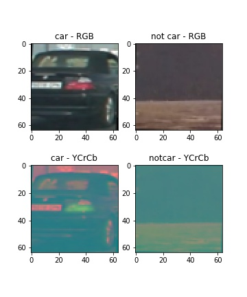
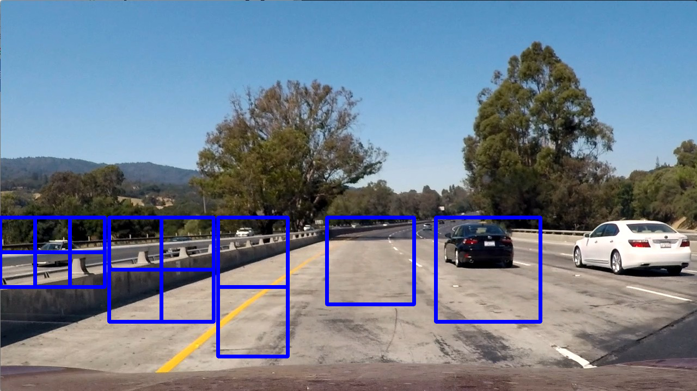

## Vehicle Detection Project

The steps of this project are the following:

* Augment training image set.
* Perform a Histogram of Oriented Gradients (HOG) feature extraction on a labeled training set of images.
* Apply a color transform and append binned color features, as well as histograms of color, to your HOG feature vector. 
* Train a classifier Linear SVM classifier
* Normalize features and randomize a selection for training and testing.
* Implement a sliding-window technique and use the trained classifier to search for vehicles in images.
* Run your pipeline on a video stream and create a heat map of recurring detections frame by frame to reject outliers and follow detected vehicles.
* Estimate a bounding box for vehicles detected.


## Rubric Points
#### Here I will consider the rubric points individually and describe how I addressed each point in my implementation.  
&nbsp;

### Writeup / README
---
#### 1. Provide a Writeup / README that includes all the rubric points and how you addressed each one.  You can submit your writeup as markdown or pdf.  [Here](https://github.com/udacity/CarND-Vehicle-Detection/blob/master/writeup_template.md) is a template writeup for this project you can use as a guide and a starting point.  

#### You're reading it!
&nbsp;

### Histogram of Oriented Gradients (HOG)
---

#### 1. Explain how (and identify where in your code) you extracted HOG features from the training images.

**HOG Features**

The code for this step is contained in `get_hog_features()` function which is in lines 48 through 60 of the file called `functions.py`. It is called by `extract_features()` to extract HOG features when HOG features toggle is switched on.

The function uses `skimage.hog()` function to the generate HOG. It takes an image, color space, and different `skimage.hog()`  parameters (`orientations`, `pixels_per_cell`, and `cells_per_block`) as inputs. It outputs a vector of HOG features, and a HOG image if the option is turned on. 

**Color Features**

On the top of HOG features, color spatial features and color histogram features are extracted. `extract_features()` function, in lines 65 through 113 of `functions.py`, is called to extract all selected features. It calls `convert_color()` function (lines 7 through 19) to change color space, `bin_spatial()` function (linse 23 through 30) to compute binned color features, `color_hist()` function (lines 34 through 43) to compute color histogram features, and `get_hog_features()` function to compute HOG features.

**Combined**

Once I had the function coded, I then explored different color spaces and different feature parameters:
color space: `cspace`
color spatial size: `spatial_size`
color histogram bins: `hist_bins`
hog orientations: `orient`
hog pixels per cell: `pix_per_cell`
hog cells per block: `cell_per_block`
I grabbed random images from each of the two classes and displayed them to get a feel for what the output looks like.
*Output will be shown in next section*

#### 2. Explain how you settled on your final choice of HOG parameters.

**Color Space**



YCrCb color space was used because it provided more information, three channels of RGB color space look redundant.

**Color Features**

For color spatial features, I started with `spatial_size=(32, 32)`, and then tried `spatial_size=(16, 16)`. Output with each of the parameters are shown below. For color histogram feature, I started with `hist_bins=32`, and then tried `hist_bins=16`. Output with each of the parameters are shown below. 


`spatial_size=(16, 16)` and `hist_bins=16` omitted too much information, thus `spatial_size=(32, 32)` and `hist_bins=32` were chosen.

It was noticed that only channel 1 histogram has significant difference between car and not-car in the `YCrCb` color space. Therefore only first channel histogram was used as features.

**HOG Features**

For HOG features, I started with `orient=9` and `cell_per_block=1`, and then tried `orient=18` and `cell_per_block=1`. Output with each of the parameters are shown below. 


Increasing `orientations` didn't increase the accuracy much therefore `orientations=9` was used. Similarly decreasing `cells_per_block` didn't reduce the accuracy much. Therefore `cells_per_block=(1, 1)` to reduce feature size.


**Combined**

Features were extracted using `YCrCb` color space, color parameters of `spatial_size=(32,32)`, `hist_bins=32`, and `hist_range=(0, 256)`,  and HOG parameters of `orientations=9`, `pixels_per_cell=(8, 8)` and `cells_per_block=(1, 1)`. Except for color histogram (channel 1 only), all features were extracted from all channels. 


#### 3. Describe how (and identify where in your code) you trained a classifier using your selected HOG features (and color features if you used them).

I trained a linear SVM using `sklearn.svm.LinearSVC`, in lines 82 through 94. Before fitting a SVM, I shuffled the training set and held 20% of them for testing. It had a test accuracy of XX%. Non-linear SVM was tried, but it took much longer time to train and classify. The small accuracy imporvement didn't outweigh the longer computation time, so linear SVM was chosen.
&nbsp;

### Sliding Window Search
---
#### 1. Describe how (and identify where in your code) you implemented a sliding window search.  How did you decide what scales to search and how much to overlap windows?

The sliding window search is implemented in `find_cars()` function, lines 117 through 196 of `funtions.py`. The `find_cars()` extracts hog features once and then are sub-sampled to get all of its overlaying windows. Each window is defined by a scaling factor where a scale of 1 would result in a window that's 8 x 8 cells then the overlap of each window is in terms of the cell distance. `find_cars()` is run 6 times for 6 different scale values to generate multiple-scaled search windows.

Each scale and the search region is defined in the code below (scale, ystart, ystop):

```python
search_boxes = [(1,400,530), (1.5,400,600), 
                (2,400,700), (2.5,400,700), (3,400,700)]
```

Following image shows a subset of the multiple-scaled search windows. Zero percent overlap was used in image for better visualization. A 75% overlap was used in the pipeline. 75% overlap was used because it yielded a better result, while minimizing number of search windows.



#### 2. Show some examples of test images to demonstrate how your pipeline is working.  What did you do to optimize the performance of your classifier?

Ultimately I searched on 5 scales using YCrCb 3-channel HOG features plus spatially binned color and histograms of color in the feature vector. Different feature parameters were tried, and ones resutling better result were used. Final pipeline. provided a nice result.  Here are some example images:


**INSERT IMAGE HERE**
&nbsp;

### Video Implementation
---
#### 1. Provide a link to your final video output.  Your pipeline should perform reasonably well on the entire project video (somewhat wobbly or unstable bounding boxes are ok as long as you are identifying the vehicles most of the time with minimal false positives.)
Here's a [link to my video result](./videos/output_project_video.mp4)

#### 2. Describe how (and identify where in your code) you implemented some kind of filter for false positives and some method for combining overlapping bounding boxes.

For each scale-search region combination, I created a heatmap from the positive detectionsand, then thresholded that map to identify vehicle positions.  I then used `scipy.ndimage.measurements.label()` to identify individual blobs in the heatmap.  I then assumed each blob corresponded to a vehicle.  I constructed bounding boxes to cover the area of each blob detected.  

Here's an example result showing the heatmap from example images, the result of `scipy.ndimage.measurements.label()` and the bounding boxes then overlaid on the images:

**Here are six frames and their corresponding heatmaps:**


**Here is the output of `scipy.ndimage.measurements.label()` on the integrated heatmap from all six frames:**


**Here the resulting bounding boxes are drawn onto the last frame in the series:**


&nbsp;

### Discussion
---
#### 1. Briefly discuss any problems / issues you faced in your implementation of this project.  Where will your pipeline likely fail?  What could you do to make it more robust?

When two cars overlap in the image, heatmap label would result in one box, tricking the computer to think there is only one car.  

Currently the pipeline is only able to detect cars such as sedan, suv, and coupe. The classifier need to be trained on images of trucks or other vehicles. I would improve the pipeline by prepossing udacity's vehicle detection training image set and training the classifier on them.

False positives could be decreased by better defining the research region for each scale. Currenly only ystart and ystop are defined. However for the same y value, cars at different x location appear in different size. If the region is better restrited, accuracy could be improved. 

To make the pipeline perform better, it could train a classifier to differentiate cars in each direction. On driving situation like freeway, car from the other direction can be ignored. While in some local roads, cars from other direction should be deteced.
